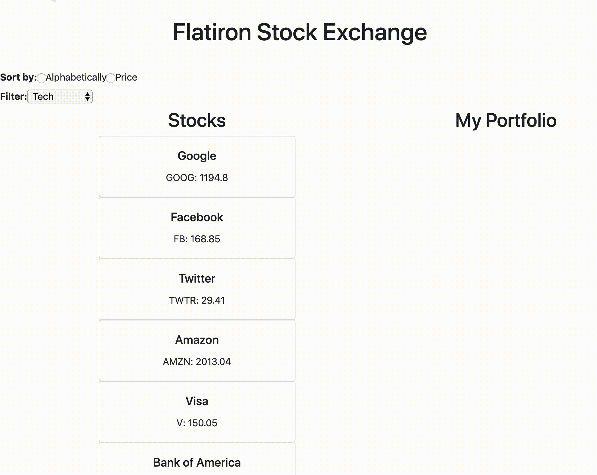

# Flatiron Stock Exchange - Lab Review



Welcome to the Flatiron Stock Exchange!
Today, you are a broker who is trying to better organize the stocks available on the Flatiron Stock Market.

## Getting Started

The database of stocks can be found in a JSON-server, so before you start your React server, make sure to start your JSON-server on `http://localhost:3000/stocks`.

```bash
  TO INSTALL: npm install -g json-server
  TO START: json-server --watch db.json
```

## Plan 📝

* Draw out the component heirarchy
* Plan state. Make sure the initial values match what you intend the values to be after your state changes

```javascript
  state: {
    stocks: [],
    portfolio: [],
    sort: '',
    filter: ''
  }
```

* Determine where to put state
  * MainContainer is the most common ancestor, so we should put state there

## Build 👷🏾‍♀️

After the stocks are fetched, your job is to:

* Render all the stocks onto the page. The styling of how a Stock should look like is already in the `Stock.js` component.
  * Fetch all the stocks on componentDidMount
  * Update state with the returned stocks
  * Pass ```this.state.stocks``` to StockContainer
  * Render a Stock Component for each Stock Object in the Array.
  
* allow a user to buy a stock by clicking on it and when it is bought, it should be added to `My Portfolio`.
  * Create a callback function and pass it all the way down to the Stock component
    * Change state to add a stock Obj to the porfolio
    * We will want to pass the stockObj to the callback function
  * Add an event listener to the Stock component

* allow a user to sell a stock in their `Portfolio` by clicking on the stock and it should be removed from their `Portfolio`.
  * Create an event listener on the stock component and callback function in the main component
    * Callback will take in a stock object
    * Remove stock object from the portfolio in state

* allow a user to sort the list of stocks alphabetically by the ticker name as well as by ascending price.
  * Create a controlled form
    * The value of our form is reading from state
    * We update the value stored in state with an onChange callback
  * Callback will be in the MainContainer
  * Event listener will be in the SearchBar comoponent
  * Rethink how we are sending Stocks arrays to our components

* allow a user to filter stocks based on the type of the stock.
  * Another controlled form that updates filter state and reads from filter state
  * Event listener goes in the SearchBar
  * Callback will in the MainContainer

Best of luck!
